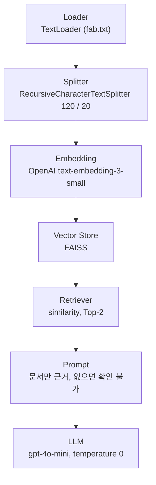
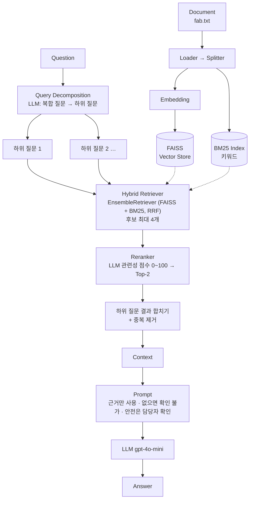
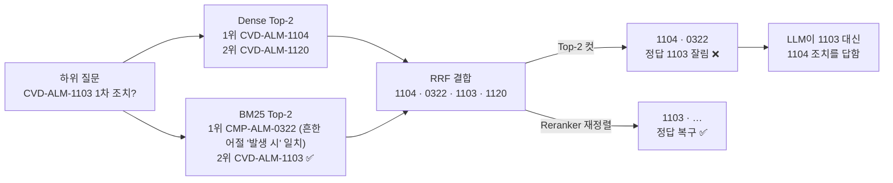

# 반도체 FAB 공정 SOP RAG — 알람 대응·로트 처리 질의응답

> 종합실습(교재 14장) 결과 보고서
> 기본 RAG → 문제 확인 → 개선 → 동일 질문 재평가
>
> ※ SOP(Standard Operating Procedure): 표준 작업 절차서. 제조 현장에서 작업 순서와 조건을 정해 둔 공식 문서

## 1. 문제 정의

### 1.1 해결하려는 문제

> 반도체 FAB의 공정 운영 SOP와 장비 알람 대응 매뉴얼을 근거로, 공정 엔지니어와 오퍼레이터의 **공정 조건·알람 조치·로트 처리** 질문에 답하는 RAG

FAB 현장에서 알람이 발생하면 매뉴얼을 빨리 찾아 1차 조치를 해야 합니다. 그런데 SOP는 공정별로 나뉘어 있고 알람 코드(`ETCH-ALM-2047` 등)도 많습니다. 그래서 원하는 조항을 찾는 데 시간이 걸립니다.
이 RAG는 질문에 맞는 SOP 조항을 검색하고, **문서에 적힌 내용만** 근거로 답합니다.

| 항목 | 정의 |
|---|---|
| ① 누가 질문하는가 | FAB 오퍼레이터, 신입 공정 엔지니어 |
| ② 어떤 문서를 검색하는가 | 공정 운영 SOP + 장비 알람 대응 매뉴얼 (교육용 가상 문서, 2장) |
| ③ 어떤 질문까지 답하는가 | 문서에 적힌 공정 조건, 장비 PM 주기, 알람 코드별 1차 조치, 로트 Hold/Release·Rework 절차, 장비 Down·복구, SPC 관리, 클린룸·안전 수칙 |
| ④ 근거가 없을 때 | "제공된 문서에서 확인할 수 없습니다."라고 답하고 추측하지 않음. 안전 관련 질문이면 담당 엔지니어·안전팀 확인을 안내 |

**범위 밖**: 실제 수율·단가·고객 정보, 문서에 없는 장비·공정(예: EUV), 레시피 변경 승인 같은 의사결정.

### 1.2 대상 사용자

| 사용자 | 상황 | 주로 묻는 질문 |
|---|---|---|
| FAB 오퍼레이터 | 교대 근무 중 알람 발생. 즉시 조치가 필요하고 짧은 구어체로 질문 | "ETCH-ALM-2047 뜨면 뭐 해?", "로트 Hold 어떻게 걸어?" |
| 신입 공정 엔지니어 | 공정 조건·관리 기준을 학습하며 여러 조항을 묶어서 질문 | "포토·식각·CVD PM 주기 각각?", "Release 승인자는?" |

## 2. 사용 데이터

`data/fab.txt` 1개 문서를 사용합니다. UTF-8 텍스트로 13개 섹션이며, 36개 chunk로 나뉩니다.

| 구분 | 섹션 |
|---|---|
| 공정 (8개) | 포토 / 식각 / 이온주입 / 확산·산화 / 증착(CVD) / 금속 배선(PVD) / CMP / 세정 — 섹션마다 공정 조건, PM 주기, 계측 기준 |
| 장비 알람 | 알람 코드 13개와 코드별 원인·1차 조치 |
| 운영 절차 | 로트 Hold·Release·Rework / 장비 Down·복구 / SPC 관리 |
| 안전 | 클린룸 출입 수칙, 케미컬·가스 누출 시 조치 |

- **RAG 실습용 가상 데이터입니다.** 실제 회사, 장비, 공정값과 무관합니다.
- 일부러 넣은 검색 난이도:
  - **비슷한 문장 반복**: 8개 공정마다 "○○ 장비의 정기 점검(PM) 주기는 N주이다" 형식의 문장이 있습니다. 의미 검색이 공정을 혼동할 수 있습니다.
  - **코드형 식별자**: 알람 코드 13개가 같은 형식으로 설명되어 있고, 숫자만 다른 코드가 많습니다(`CVD-ALM-1103` / `1104` / `1120`). 임베딩만으로는 숫자 하나 차이를 구분하기 어렵습니다.
  - **복합 질문**: 알람 조치와 로트 Release 승인처럼 답이 서로 다른 섹션에 흩어져 있습니다.
  - **비슷한 절차**: 로트 Hold/Release와 장비 Down/복구가 비슷한 구조로 쓰여 있어 승인 주체가 헷갈리기 쉽습니다.

문서 발췌 (알람 코드 섹션):

```text
ETCH-ALM-2047: 식각 챔버 압력 이탈. 1차 조치는 진행 중인 웨이퍼를 완료 후 장비를 Idle로 전환하고 진공 펌프 상태를 확인하는 것이다.
ETCH-ALM-2051: 식각 RF 파워 반사율 과다. 1차 조치는 매칭 박스 리셋 후 재시도하며 2회 반복 시 설비 엔지니어를 호출하는 것이다.
CVD-ALM-1103: CVD 히터 온도 이탈. 1차 조치는 즉시 공정을 중단하고 해당 로트를 Hold 처리하는 것이다.
CVD-ALM-1104: CVD 챔버 압력 이탈. 1차 조치는 스로틀 밸브 상태를 확인하고 배기 라인을 점검하는 것이다.
```

## 3. RAG 구조

### 3.1 Baseline



### 3.2 최종 개선 Pipeline



### 3.3 비교한 Pipeline

| Pipeline | 검색 방식 | 근거 실습 |
|---|---|---|
| Baseline | FAISS similarity, Top-2 | step06 |
| 개선 1 Hybrid | EnsembleRetriever(FAISS 2 + BM25 2, 가중치 0.5/0.5, RRF) → Top-2로 자름 | step10 `10_search_quality.py` |
| 개선 2 + Decomposition | LLM으로 하위 질문을 분해한 뒤 질문마다 Hybrid Top-2 → 합치고 중복 제거 | step11 `11_advanced_rag.py` `decompose_query()` |
| 개선 3 + Rerank (최종) | 하위 질문마다 Hybrid 후보 전체(최대 4개)를 LLM 관련성 점수로 재정렬 → Top-2 | step10 `relevance_score()` / `rerank()` |

- Hybrid는 Baseline과 공정하게 비교하려고 결합 결과를 같은 Top-2로 자릅니다.
- BM25는 `ETCH-ALM-2047:` 같은 코드가 콜론 때문에 매칭되지 않는 문제가 있었습니다. 그래서 기호 기준 토큰화(`[\w\-]+`)를 적용했습니다.

### 3.4 개선 전략 선택 이유

교재 14.6의 "관찰된 문제 → 우선 검토할 방법" 표를 기준으로 선택했습니다.

| 관찰된 문제 | 14.6 권장 방법 | 적용 |
|---|---|---|
| 알람 코드 같은 **코드·약어**가 Dense 검색으로 잘 구분되지 않음 | BM25 / Hybrid / Ensemble | **Hybrid (EnsembleRetriever)** |
| **복합 질문**의 답이 여러 섹션에 흩어져 Top-K에 다 들어오지 않음 | Query Rewrite / Decomposition | **Query Decomposition** |
| (2단계 적용 후 관찰) **후보는 찾지만 순서가 좋지 않아** Top-K 컷에서 정답이 잘림 | Reranker | **LLM Reranker** |

- Reranker는 처음 계획에는 없었습니다. Decomposition을 적용한 뒤 생긴 회귀(8.2장)를 진단하고 추가했습니다.
- **MMR은 선택하지 않았습니다.** 이 문서의 문제는 "중복 chunk"가 아니라 "정확한 코드 불일치"와 "흩어진 근거"였기 때문입니다.
- **Agentic RAG**는 남은 한계(9장)로 기록했습니다.

## 4. 설치 방법

Python 3.11과 [uv](https://docs.astral.sh/uv/)가 필요합니다.

```bash
cd final_capstone/practice
cp .env.example .env      # Windows: Copy-Item .env.example .env
uv sync
```

`.env`에 `OPENAI_API_KEY`를 입력합니다. LangSmith 트레이싱은 선택입니다. 쓰려면 `LANGSMITH_TRACING=true`와 `LANGSMITH_API_KEY`를 함께 입력합니다.
API Key가 들어 있는 `.env`는 `.gitignore`로 제외되어 있습니다. `.env.example`에는 변수명만 둡니다.

> **주의**: 쉘(`~/.zshrc` 등)에 `OPENAI_API_KEY`가 export되어 있으면 `load_dotenv()`가 `.env` 값으로 덮어쓰지 않습니다. 예전 키 때문에 401 오류가 나면 쉘 설정을 고치거나 `env -u OPENAI_API_KEY uv run ...`으로 실행하세요.

## 5. 실행 방법

```bash
uv run --locked python src/capstone_compare.py
# 문서와 Top-K를 바꾸려면: uv run --locked python src/capstone_compare.py data/fab.txt 3
```

출력 순서는 다음과 같습니다.
1. 문서·Chunk 수와 metadata
2. Pipeline별로 질문 10개의 HIT/MISS, RR, 검색 문서 원문
3. Hit Rate / MRR / 평균 문서 수 비교표
4. 질문별 Baseline / Decomp / Rerank 답변

실행 1회에 LLM을 254회 호출했고, 비용은 약 $0.007였습니다(LangSmith 실측, 임베딩 비용 제외). 실행 결과는 `results/run_fab_k2.txt`에 저장했습니다.

LangSmith 트레이싱을 켜고 실행하면 Pipeline별 지연·LLM 호출·토큰·비용을 trace로 확인할 수 있습니다(8.5장, 집계 결과는 `results/langsmith_metrics.txt`).

## 6. 테스트 질문과 평가 방법

### 6.1 테스트 질문

교재 14.4의 5개 유형별로 2개씩, 총 10개입니다.

| # | 유형 | 질문 | 정답 키워드 |
|---|---|---|---|
| Q1 | 정답 명확 | CMP 연마 패드는 언제 교체하나요? | 500매 |
| Q2 | 정답 명확 | Hold 된 로트를 Release 하려면 누구의 승인이 필요한가요? | 엔지니어의 승인 |
| Q3 | 표현 다름 | 세정 약품은 얼마나 자주 갈아줘야 해? | 24시간마다 |
| Q4 | 표현 다름 | 같은 공정에서 다시 작업하는 건 몇 번까지 돼? | 최대 2회 |
| Q5 | 키워드 | ETCH-ALM-2047 알람 조치 방법은? | 진공 펌프 |
| Q6 | 키워드 | CMP-ALM-0322 발생 시 무엇을 해야 하나요? | 슬러리 필터 |
| Q7 | 복합 | CVD-ALM-1103 발생 시 1차 조치와, Hold 된 로트의 Release 승인자를 함께 알려줘 | 즉시 공정을 중단 + 엔지니어의 승인 |
| Q8 | 복합 | 포토, 식각, CVD 장비의 PM 주기를 각각 알려줘 | 포토/식각/CVD 장비의 정기 점검 (3개 모두) |
| Q9 | 문서에 없음 | 이번 분기 웨이퍼 수율은 얼마인가요? | — (Hit Rate 제외) |
| Q10 | 문서에 없음 | EUV 노광 장비의 소스 파워 설정값은? | — (Hit Rate 제외) |

정답 키워드는 문서 전체에서 정확히 1번만 등장하도록 확인했습니다. 다른 조항에 같은 키워드가 있어 HIT로 잘못 판정되는 일을 막기 위해서입니다.

### 6.2 실험 조건

| 항목 | 설정 |
|---|---|
| 문서 | `data/fab.txt` (13개 섹션) |
| Chunk | RecursiveCharacterTextSplitter 120 / 20 → **36개** |
| Embedding / Vector Store | OpenAI `text-embedding-3-small` / FAISS |
| Top-K | **2** |
| Chat Model | `gpt-4o-mini`, temperature=0 |

**Top-2를 고른 이유**: 오퍼레이터는 알람이 뜬 상황에서 짧고 정확한 답이 필요합니다. 그래서 Context를 작게 유지하는 조건에서 각 Pipeline이 정답 근거를 확보하는지를 보려고 했습니다.

### 6.3 평가 지표

- **Hit Rate**: Top-K 안에 정답 키워드가 있으면 HIT입니다. 복합 질문은 키워드가 **모두** 있어야 HIT입니다. Q1~Q8만으로 계산합니다.
- **MRR**: 정답 키워드가 처음 갖춰지는 순위 n에 대해 1/n을 구한 평균입니다. "관련 문서가 상위에 배치되는가"를 측정합니다.
- **평균 검색 문서 수**: LLM에 들어가는 Context 크기입니다. 클수록 비용과 노이즈가 늘어납니다.
- **Generation**: 질문마다 Baseline / Decomposition / Rerank의 답변을 비교합니다. ① 근거와 일치하는지 ② 질문에 직접 답하는지 ③ Q9·Q10에서 근거 없는 답을 만들지 않는지 확인합니다.

## 7. Baseline 결과

| Hit Rate | MRR | 발견한 문제 |
|---|---|---|
| 0.750 (6/8) | 0.625 | ① 숫자만 다른 알람 코드를 구분하지 못해 정답이 2위로 밀림(Q5). 관련 없는 조항이 1위에 오기도 함(Q1). ② 복합 질문 Q7·Q8 MISS. 답변은 "승인자/식각 PM은 확인할 수 없습니다"로 일부만 답함 |

Baseline 검색 예시 (Q5 `ETCH-ALM-2047 알람 조치 방법은?`):

```text
[1] ETCH-ALM-2051: 식각 RF 파워 반사율 과다. …          ← 숫자 하나 다른 코드가 1위
[2] ETCH-ALM-2047: 식각 챔버 압력 이탈. … 진공 펌프 …   ← 정답은 2위 (RR 0.5)
```

문서에 없는 질문(Q9·Q10)은 Baseline부터 "확인할 수 없습니다"로 정상 처리했습니다.

## 8. 개선 방법과 결과

### 8.1 Retrieval 결과

| Pipeline | Hit Rate | MRR | 평균 문서 수 |
|---|---|---|---|
| Baseline | 0.750 | 0.625 | 2.0 |
| + Hybrid | 0.750 | 0.750 | 2.0 |
| + Decomposition | 0.875 | 0.792 | 3.0 |
| + Rerank (최종) | **1.000** | **0.833** | 3.0 |

> Decomposition과 Rerank는 LLM 출력에 의존합니다. temperature=0이어도 실행마다 하위 질문 수와 답변 문장이 조금 달라질 수 있습니다.

**질문별 결과 (괄호 안은 RR)**

| 질문 | 유형 | Baseline | Hybrid | +Decomp | +Rerank | 답변 변화 (Baseline → 최종) | 판단 |
|---|---|---|---|---|---|---|---|
| Q1 CMP 패드 교체 | 정답 명확 | HIT (0.5) | HIT (1.0) | HIT (1.0) | HIT (1.0) | 동일 (정답) | 좋아짐 (순위) |
| Q2 Release 승인자 | 정답 명확 | HIT (1.0) | HIT (1.0) | HIT (1.0) | HIT (1.0) | 동일 (정답) | 동일 |
| Q3 세정 약품 교체 | 표현 다름 | HIT (1.0) | HIT (1.0) | HIT (1.0) | HIT (1.0) | 동일 (정답) | 동일 |
| Q4 재작업 횟수 | 표현 다름 | HIT (1.0) | HIT (1.0) | HIT (1.0) | HIT (1.0) | 동일 (정답) | 동일 |
| Q5 ETCH-ALM-2047 | 키워드 | HIT (0.5) | HIT (1.0) | HIT (1.0) | HIT (1.0) | 동일 (정답) | 좋아짐 (코드 일치 1위) |
| Q6 CMP-ALM-0322 | 키워드 | HIT (1.0) | HIT (1.0) | HIT (1.0) | HIT (1.0) | 동일 (정답) | 동일 |
| Q7 CVD-ALM-1103 + 승인자 | 복합 | **MISS** | **MISS** | **MISS** | HIT (0.333) | 승인자 "확인 불가" → 둘 다 정답 | 좋아짐 (중간 단계 회귀, 8.2장) |
| Q8 포토·식각·CVD PM | 복합 | **MISS** | **MISS** | HIT (0.333) | HIT (0.333) | 식각 PM "확인 불가" → 3개 모두 정답 | 좋아짐 |
| Q9 이번 분기 수율 | 문서에 없음 | 제외 | 제외 | 제외 | 제외 | "확인할 수 없습니다" 유지 | 동일 (정상) |
| Q10 EUV 소스 파워 | 문서에 없음 | 제외 | 제외 | 제외 | 제외 | "확인할 수 없습니다" 유지 | 동일 (정상) |

**Retrieval 평가**
- **정답 문서가 Top-K에 포함되는가?** Baseline은 복합 질문 2개를 놓쳤습니다. 근거가 서로 다른 섹션의 2~3개 chunk에 흩어져 있어 Top-2로는 다 담을 수 없었습니다. 최종 Pipeline은 8/8을 맞혔습니다.
- **관련 문서가 상위에 배치되는가?** Baseline의 Dense 검색은 숫자 하나만 다른 알람 코드를 구분하지 못했습니다. Hybrid의 BM25가 정확한 코드 토큰을 맞추면서 MRR이 0.625에서 0.750으로 올랐습니다.
- **중복·무관 문서가 지나치게 많지 않은가?** Decomposition은 하위 질문 수만큼 검색하므로 평균 문서 수가 2.0에서 3.0으로 1.5배 늘었습니다. 단일 질문(Q3~Q6)도 하위 질문이 여러 개로 나뉘면서 3~4개 문서가 들어왔고, 그중에는 무관한 chunk도 있었습니다.

### 8.2 Decomposition 단계의 회귀와 Reranker

Q7에서 Decomposition을 적용하자 **질문한 알람이 아닌 다른 알람의 조치를 답하는 회귀**가 생겼습니다. FAB에서는 잘못된 조치로 이어질 수 있는 위험한 오답입니다.

| Pipeline | Q7 답변 |
|---|---|
| Baseline | CVD-ALM-1103 발생 시 1차 조치는 즉시 공정을 중단하고 해당 로트를 Hold 처리하는 것입니다. Hold 된 로트의 Release 승인자는 **제공된 문서에서 확인할 수 없습니다.** |
| + Decomposition | **CVD-ALM-1104** 발생 시 1차 조치는 스로틀 밸브 상태를 확인하고 배기 라인을 점검하는 것입니다. Hold 된 로트의 Release는 담당 공정 엔지니어의 승인이 필요합니다. (← 1103을 물었는데 1104의 조치를 답함) |
| + Rerank | CVD-ALM-1103 발생 시 1차 조치는 즉시 공정을 중단하고 해당 로트를 Hold 처리하는 것입니다. Hold 된 로트의 Release는 담당 공정 엔지니어의 승인이 필요합니다. ✅ |

원인 분석 (하위 질문 "CVD-ALM-1103 발생 시 1차 조치는 무엇인가요?", Top-2):



- 정답 chunk는 Hybrid 후보에 **있었지만**, RRF로 합친 뒤 Top-2로 자르는 과정에서 잘렸습니다. 교재 14.6의 "후보 문서는 찾지만 순서가 좋지 않음"에 해당하므로 Reranker를 적용했습니다.
- Prompt로 "추측하지 말라"고 했는데도 LLM은 "1103 정보가 없다"고 답하지 않고, 비슷한 근거(1104)로 답을 만들었습니다. **Prompt 규칙만으로는 비슷한 근거로 인한 오답을 막을 수 없다**는 점을 확인했습니다.

### 8.3 Generation 평가

- **답변이 검색 Context의 근거와 일치하는가?** 대부분 문서 문장을 거의 그대로 사용했습니다. 예외는 8.2장의 Decomposition 단계 Q7이고, 최종 Pipeline에서 해결했습니다.
- **질문에 직접 답하는가?** 최종 Pipeline은 복합 질문(Q7, Q8)의 모든 부분에 답했습니다. Baseline은 Context가 부족한 부분을 "확인할 수 없습니다"로 남겨 일부만 답했습니다.

  | Q8 | 답변 |
  |---|---|
  | Baseline | 포토 장비의 PM 주기는 2주, CVD 장비의 PM 주기는 4주입니다. 식각 장비의 PM 주기는 제공된 문서에서 확인할 수 없습니다. |
  | + Rerank | 포토 장비의 정기 점검(PM) 주기는 2주, 식각 장비의 정기 점검(PM) 주기는 3주, CVD 장비의 정기 점검(PM) 주기는 4주입니다. |

- **근거가 없을 때 내용을 만들어내지 않는가?** Q9(수율)와 Q10(EUV)은 모든 Pipeline에서 "제공된 문서에서 확인할 수 없습니다."로 답했습니다.

  Q10의 경우 검색된 문서는 `[1. 포토 공정]`(노광 장비 렌즈 온도), `[7-1. 장비 Down 및 복구 절차]`, `ETCH-ALM-2051`(RF 파워)로, "노광", "파워"라는 단어만 겹친 무관한 문서였습니다. 그래도 LLM은 렌즈 온도나 RF 파워 같은 비슷한 수치를 답으로 쓰지 않았습니다. **검색이 무관한 문서를 반환해도 Prompt 규칙으로 근거 없는 답변을 막았습니다.**
  8.2장의 Q7과 비교하면 차이가 보입니다. Q7에서는 Context에 형식이 같은 다른 알람 코드(1104)가 있어서 LLM이 그것을 정답으로 착각했습니다. 근거가 **아예 없을 때**는 Prompt 규칙이 잘 작동하지만, **비슷한 근거가 있을 때**는 작동하지 않았습니다.

### 8.4 개선 요약

| 단계 | 해결한 문제 | 효과 | 부작용 |
|---|---|---|---|
| Hybrid | 숫자만 다른 알람 코드 구분 (Q1, Q5) | MRR 0.625 → 0.750 | Hit Rate 변화 없음 |
| + Decomposition | 흩어진 근거 (Q8) | Hit Rate 0.750 → 0.875 | Context 1.5배, **Q7 오답 회귀** |
| + Rerank | Top-K 컷에서 잘리는 정답 (Q7) | Hit Rate 1.000, MRR 0.833 | 질문당 LLM 호출 11.2회, 응답 7.7초 (8.5장) |

### 8.5 비용·지연 (LangSmith 실측)

LangSmith trace로 Pipeline별 검색·생성 비용을 측정했습니다. "검색+생성"은 질문 1개에 대해 검색부터 최종 답변까지 걸린 값의 평균입니다(Q1~Q10).

| Pipeline | 검색 지연(초) | 검색+생성 지연(초) | 질문당 LLM 호출 | 질문당 토큰 | 질문당 비용(USD) |
|---|---|---|---|---|---|
| Baseline | 0.15 | 0.92 | 1.0 | 268 | 0.00005 |
| + Hybrid | 0.15 | - | - | - | - |
| + Decomposition | 1.56 | 2.39 | 2.0 | 456 | 0.00011 |
| + Rerank (최종) | 7.06 | **7.73** | **11.2** | **1,530** | **0.00027** |

- Hybrid는 답변 생성 비교에 넣지 않아 검색 지연만 측정했습니다. BM25는 로컬 계산이라 지연이 거의 늘지 않았습니다.
- 최종 Pipeline은 Baseline보다 **응답이 약 8.4배 느리고, LLM 호출은 11배, 토큰은 5.7배** 많습니다. 증가분의 대부분은 Reranker가 후보마다 LLM을 순차 호출하는 데서 나옵니다(검색 단계에서만 7초).
- 비용은 gpt-4o-mini 기준 질문당 $0.0003 수준이라 작습니다. 하지만 **알람 대응에 7~8초 응답은 현장에서 체감되는 지연**입니다. 그래서 9장의 Cross-Encoder 교체와 복합 질문만 분해하는 라우팅이 우선 개선 과제입니다.
- 임베딩 API 호출은 LangSmith trace에 LLM 비용으로 잡히지 않아 비용에서 빠져 있습니다.

## 9. 한계와 추가 개선 방향

| 한계 | 개선 방향 |
|---|---|
| LLM Reranker는 후보마다 LLM을 순차 호출해 비용과 지연이 큼. 실측 결과 질문당 LLM 호출 1회 → 11.2회, 응답 0.92초 → 7.73초 (8.5장) | Cross-Encoder Reranker로 교체, 후보 점수 계산 병렬화 |
| 단일 질문도 분해되어 Context가 늘어남 | 복합 질문만 분해하도록 라우팅 (step11 `route_query` 방식) |
| BM25가 공백·기호 기준 토큰화라서 "발생 시" 같은 흔한 어절에 끌림 | 한국어 형태소 분석(Kiwi) + 불용어 처리 |
| 비슷한 근거로 오답을 만듦(1103 ↔ 1104). 검색 개선만으로는 완전히 막을 수 없음 | 답변 속 코드와 질문 속 코드의 일치를 사후 검증, step13 Agentic RAG의 grade → rewrite → fallback |
| 안전 관련 답변 오류는 치명적임 | 안전 섹션은 원문 인용과 안전팀 연락처를 고정 출력 |
| 키워드 포함 여부로 Hit를 판정하므로 표현이 다른 정답은 놓칠 수 있음 | 정답 chunk ID 기반 평가, LLM-as-Judge, RAGAS |
| 질문 10개, 문서 1개로 표본이 작음. 처음에는 공정 5개짜리 작은 문서와 Top-3으로 실험했으나 모든 Pipeline의 Hit Rate가 1.0이라 차이가 없었음. 그래서 비슷한 조항을 추가하고 Top-2로 조건을 강화함. 즉 **실험 조건을 결과를 보고 조정함** | 실제 SOP 다수 + 질문 50개 이상으로 확장. 수치보다 **실패 유형과 개선 메커니즘**에 의미를 둠 |

---

## 발표 요약

1. **해결하려 한 문제**: FAB 오퍼레이터가 알람 코드나 로트 처리 절차를 SOP에서 빠르고 정확하게 찾는 것
2. **Baseline에서 발견한 문제**: 숫자만 다른 알람 코드를 구분하지 못함(Q5 정답 2위). 흩어진 근거를 Top-K에 다 담지 못해 복합 질문에 일부만 답함
3. **선택한 전략**: 코드 불일치 → Hybrid(BM25), 흩어진 근거 → Query Decomposition, 새로 생긴 순위 문제 → Reranker (교재 14.6 표 기준)
4. **검색 결과 변화**: Hit Rate 0.750 → 1.000, MRR 0.625 → 0.833
5. **답변 변화**: 복합 질문이 "일부 확인 불가"에서 완전한 정답으로 바뀜. 중간 단계에서 **다른 알람 조치를 답하는 위험한 회귀**를 발견했고 Reranker로 해결함
6. **남은 한계**: 응답 지연 0.9초 → 7.7초(LangSmith 실측, 대부분 Reranker), 비슷한 근거로 인한 오답 위험(사후 검증 필요), 작은 평가셋

## 최종 제출 전 점검

- [x] 질문 → 검색 → Context → 답변 흐름을 설명할 수 있다 (3장)
- [x] 검색된 문서를 직접 확인하는 코드가 있다 (`evaluate()`가 Top-K 원문 출력)
- [x] Baseline과 개선 버전을 비교했다 (7장, 8장)
- [x] 선택한 전략이 해결하려는 문제와 연결된다 (3.4장, 8.2장)
- [x] 문서에 없는 정보에 대한 처리 방식을 정했다 (Prompt 규칙, Q9·Q10)
- [x] API Key와 내부 정보가 소스에 포함되지 않았다 (`.env`는 gitignore, 데이터는 가상)
- [x] 실행 방법이 README에 정리되어 있다 (4장, 5장)
